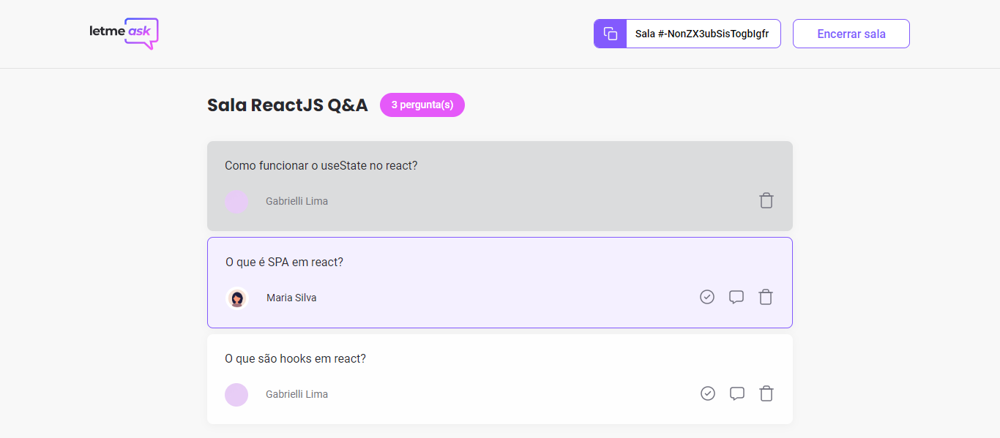

# NLW ReactJS

Aplicação web para criadores de conteúdos poderem criar salas de perguntas e respostas(Q&A) com o seu público, de uma forma organizada e simples.

## Funções presentes na aplicação:
- Login com conta do Google
- **Usuário comum**:
  - Criar perguntas
  - Curtir perguntas

- **Administrador da sala**:
  - Criar salas
  - Marcar pergunta como respondida
  - Dar destaque a uma pergunta
  - Deletar pergunta
  - Encerrar sala

## Preview

  
  
  
  

> Projeto desenvolvido na missão ReactJS no NLW #06 da Rocketseat.

[🔗 Clique aqui para acessar](https://letmeask-ef9f2.web.app/)

## 🛠️ Tecnologias

- ReactJS
- Typescript
- Firebase
- Sass
